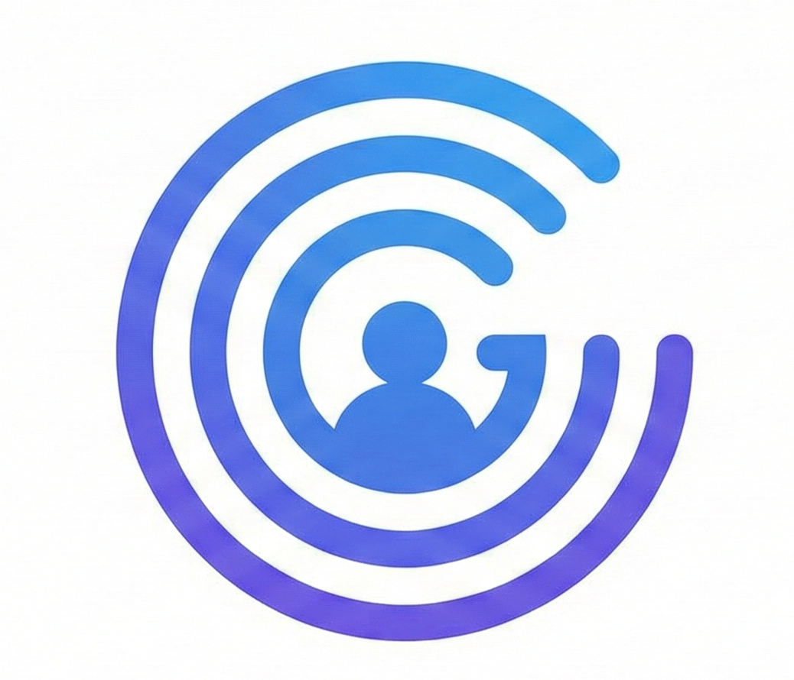

# GEIST: Invisible Fall Detection System 👻

> **"A Ghost Guardian for the Elderly."**
> 
> *Zeroth Review Prototype - Jan 2026*

## 📖 Overview
**Geist** is a non-intrusive, privacy-focused IoT system designed to detect human falls in indoor environments without the use of cameras or wearables. 

Current systems rely on uncomfortable wearables (which are often forgotten) or cameras (which invade privacy). Geist leverages **Wi-Fi Channel State Information (CSI)** and sensor fusion to detect motion anomalies invisibly.

## 🚀 Key Features
* **Invisible Monitoring:** No cameras, no wearables.
* **Real-Time Alerts:** Instant notifications.
* **Multi-Sensory Feedback:** * 📱 **Visual:** App turns Red/Orange.
    * 📳 **Haptic:** Custom vibration patterns on the admin's phone.
    * 🔊 **Audio:** Push notifications with sound.
* **SOS Response:** One-tap emergency dialing (108/911).
* **Event Logging:** SQLite-backed history of all safety events.
* **Persistent Config:** Settings are saved locally on the device.

## 🛠️ Tech Stack
| Component | Technology | Description |
|-----------|------------|-------------|
| **Hardware** | ESP32 | Captures sensor data & handles Wi-Fi transmission. |
| **Backend** | Python (Flask) | Runs the logic, manages SQLite DB, and emits Socket events. |
| **Frontend** | Flutter (Dart) | Cross-platform mobile dashboard for the admin. |
| **Protocol** | WebSockets | Low-latency, bi-directional communication. |

## 🔬 Research Foundation
This project is based on the research paper:  
* **"Human Fall Detection in Indoor Environments Using Channel State Information of Wi-Fi Signals"**
* *Methodology:* Uses LSTM (Long Short-Term Memory) networks to analyze CSI amplitude/phase.
* *Key Finding:* Achieved ~83.3% accuracy in fall detection by filtering "static" paths using PCA.

## 🚧 Still under Construction 

